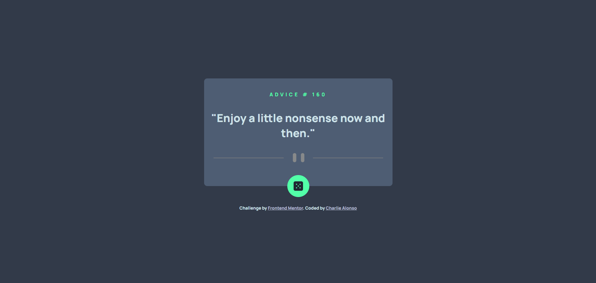

# Frontend Mentor - Advice generator app solution

This is a solution to the [Advice generator app challenge on Frontend Mentor](https://www.frontendmentor.io/challenges/advice-generator-app-QdUG-13db). Frontend Mentor challenges help you improve your coding skills by building realistic projects.

## Table of contents

- [Frontend Mentor - Advice generator app solution](#frontend-mentor---advice-generator-app-solution)
  - [Table of contents](#table-of-contents)
  - [Overview](#overview)
    - [Screenshot](#screenshot)
    - [Links](#links)
  - [My process](#my-process)
    - [Built with](#built-with)
    - [What I learned](#what-i-learned)
  - [Author](#author)

## Overview 

### Screenshot

### Links

- Solution URL: [[Add solution URL here](https://github.com/Charlie025x/Advice-generator-app)](https://github.com/Charlie025x/Advice-generator-app)
- Live Site URL: [[Add live site URL here](https://charlie025x.github.io/Advice-generator-app/)](https://charlie025x.github.io/Advice-generator-app/)

## My process

### Built with

- Flexbox
- Mobile-first workflow
- scss

### What I learned

I got some much needed review on api fetch request. After plenty of error in my Javascript, I learned I had to do change my HTML'S inner text inside the try block, otherwise the dom manipulation code runs before the api fetch request, resulting in errors. 

## Author

- Website - [Charlie Alonso](https://charlie-alonso.netlify.app/)
- GitHub - [Charlie025x](https://github.com/Charlie025x)
- Frontend Mentor - [@Charlie025x](https://www.frontendmentor.io/profile/Charlie025x)
- LinkedIn - [Charliealonso002](https://www.linkedin.com/in/charliealonso002/)